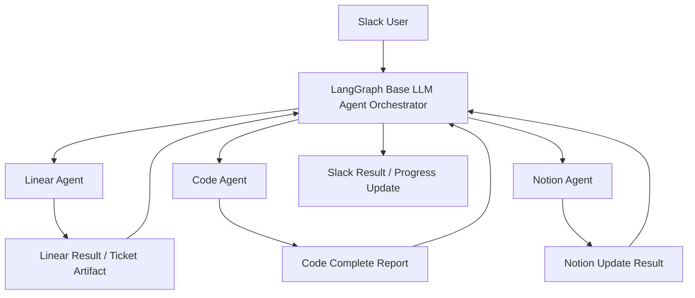
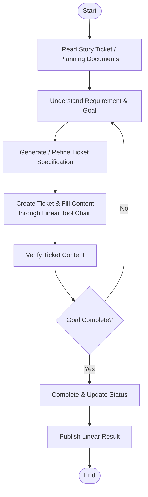
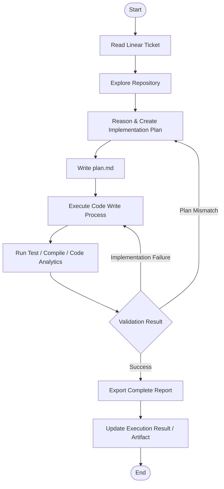
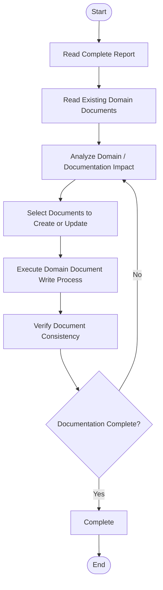
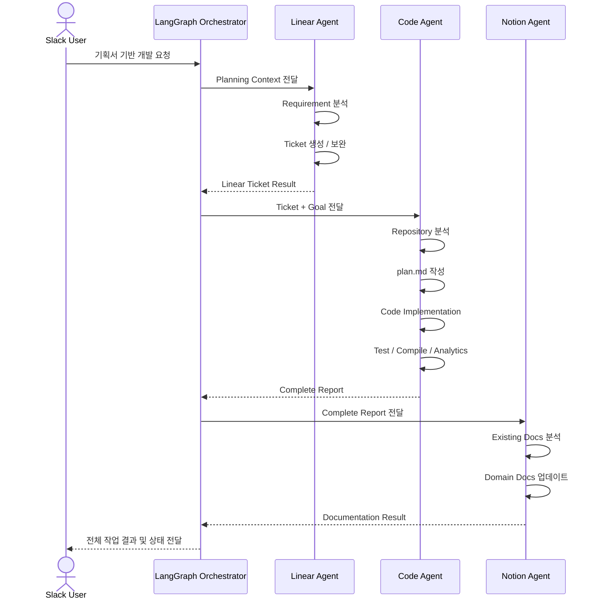
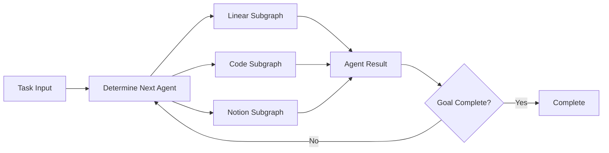
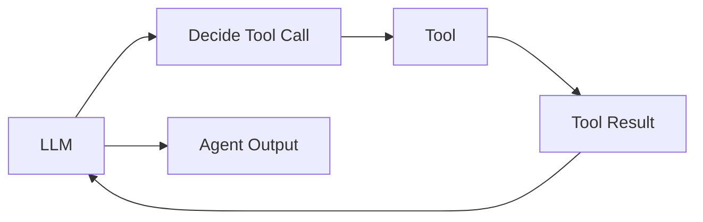

# Slack Development Agent

기획서를 기반으로 **Linear → Code → Notion** 개발 프로세스를 하나의 통합 Agent Workflow로 연결하여,
개발 과정에서 발생하는 반복적인 handoff와 문서화 비용을 줄이고 **개발 Process Lead Time을 단축**하는 것을 목표로 합니다.

---

## 현재 구현 메모 (Goodra-bot)

- 요청 라우팅: `실행`·`취소`·`폐기`·`trace 요약`, 스레드 요약, `Linear 이슈 조회/생성/수정…` 고정 명령만 코드에서 판정한다. 그 밖의 메시지는 `.env`의 `CODE_WORK_MODE`(analysis·plan·edit)가 정한다: analysis는 읽기 전용 답변, plan·edit는 모두 코드 작업이다. LLM 분류기도 키워드 목록도 두지 않는다.
- 봇 지침: `harness/*.md`를 읽어 프로젝트 없이 답하는 일반 답변의 프롬프트에 넣는다. 지침은 안내일 뿐이고, 쓰기·외부 변경의 확인과 가드는 코드에서 강제한다.
- 보호 파일 편집: `plan.md` 등 관리 파일은 현재 메시지뿐 아니라 같은 스레드에서 **사용자가 직접 한 이전 발화**에 이름이 있어도 편집 허용 목록에 들어간다. 사용자 발화는 문맥 파일(`<ts>.md`)과 별도로 `<ts>.user.jsonl`에 쌓는다. 봇 응답·읽어 온 데이터에서는 이름을 뽑지 않고, 가드(`edit_guard`·`plan_guard`)는 그대로다.
- 프로젝트 지침과 skill (Phase 23): Claude 실행기(분석·편집)는 `setting_sources=["project"]`로 열어 `CLAUDE.md`를 SDK가 읽게 하고, 프로젝트 hook은 `disableAllHooks`로 끈다. Claude는 `AGENTS.md`를 네이티브로 읽지 않으므로 루트 `AGENTS.md`를 `src/project_guidance.py`가 프롬프트 앞에 붙인다 (Codex CLI는 네이티브로 읽는다). skill은 `.piplup/allowed-skills.txt`의 `claude:<이름>` 항목만 `skills`로 켜고 `Skill` 도구를 추가한다. 텍스트 전용 호출은 격리를 유지한다. `.piplup/`은 보호 경로이고, 지침·skill은 도구 가드(`edit_guard`)와 편집 뒤 검토(`review_worktree`)를 넓히지 못한다. 편집 응답의 "적용 AGENTS.md / 적용 Skill"은 worktree에 실제로 있는 것을 표시한다.
- 실행: `python -m src.socket_mode` (Socket Mode만 지원).

---

## Core KPI

> **기획서 기반 Linear + Code + Notion 통합 Agent를 통해 개발 Process Lead Time 감소**

주요 개선 대상은 다음과 같습니다.

- 기획 문서에서 개발 Ticket 생성까지의 시간 단축
- Ticket 이해 및 Code 작업 착수까지의 시간 단축
- 구현 → 테스트 → 완료 보고 과정 자동화
- 개발 완료 결과를 기반으로 Notion Domain Document 자동 갱신
- Linear / Code / Notion 사이의 수동 Handoff 최소화

### Target Flow

```text
Planning Document
    ↓
Linear Ticket
    ↓
Code Implementation
    ↓
Test / Compile / Code Analytics
    ↓
Completion Report
    ↓
Notion Domain Documentation
```

---

## Architecture

### Technology


| Layer               | Technology              | Responsibility                                                        |
| ------------------- | ----------------------- | --------------------------------------------------------------------- |
| Agent Orchestration | LangGraph               | Agent routing, handoff, retry loop, workflow orchestration            |
| LLM Tool Chain      | LangChain               | LLM invocation, tool binding, structured output, tool execution chain |
| Linear Agent        | Linear GraphQL API      | 현재 팀·이슈 조회 및 이슈 생성·수정; 상태 변경은 이슈 수정에 포함                         |
| Code Agent          | Code Tool / Shell / Git | Repository 분석, Planning, 구현, 테스트, 정적 분석                               |
| Notion Agent        | Notion API / MCP        | 완료 보고 분석, Domain Document 생성 및 수정                                     |
| Interface           | Slack Bot               | 사용자 요청 입력, 진행 상황 공유, 결과 전달                                            |

현재 구현에서는 Linear MCP 서버가 연결되어 있지 않습니다. `LINEAR_API_KEY`가 있으면
`https://api.linear.app/graphql`의 고정 query/mutation으로 팀·이슈를 조회하고 이슈를
생성·수정할 수 있습니다. Linear 설계나 지원 범위 질문은 API를 호출하지 않고 현재
지원 기능을 답합니다. 이슈 변경은 미리보기 후 같은 Slack 스레드에서 `실행` 확인을
받아 적용합니다.

코드 작업은 관련 구현·테스트를 읽은 뒤 계획과 diff를 미리 보여줍니다. 보류 중인
계획이 있어도 설계 질문은 질문으로 처리하며, 기존 계획은 명시적인 `실행` 또는
`취소`까지 유지됩니다. 아래의 전체 Linear → Code → Notion 흐름은 목표 아키텍처입니다.
프로젝트명에는 로컬 폴더명이나, 로컬 체크아웃 한 곳에만 대응하는 Git `origin`
저장소 이름을 사용할 수 있습니다. 예를 들어 `slack_bot_agent`는 로컬
`piplup-agent-v2` 폴더를 가리킵니다.


---

## High-Level Agent Flow



Orchestrator는 각 Agent를 직접 구현하는 역할이 아니라, 현재 Goal과 Agent 실행 결과를 기준으로 **다음에 실행할 Agent를 결정하고 Handoff를 관리**합니다.

```text
Agent Output
    ↓
Orchestrator
    ↓
Determine Next Action
    ↓
Next Agent
```

---

# Agent Flow

## 1. Linear Agent

Linear Agent는 기획서, Story, Plan Document 등의 Context를 읽고 개발 가능한 Ticket 형태로 변환합니다.



### Responsibilities

- 기획서 및 관련 Story Context 조회
- Requirement와 Acceptance Criteria 추출
- 개발 가능한 수준으로 Ticket 구체화
- Linear Ticket 생성 및 내용 보완
- Ticket 생성 결과 검증
- Ticket 상태 업데이트
- Orchestrator에 결과 반환

### Example Output

```json
{
  "agent": "linear",
  "status": "completed",
  "ticketId": "DEV-123",
  "goal": "Implement shipment delay notification",
  "acceptanceCriteria": [
    "Detect delayed shipment",
    "Create notification event",
    "Expose notification through API"
  ]
}
```

---

## 2. Code Agent

Code Agent는 Linear Ticket을 입력으로 받아 Repository를 분석하고, 실행 가능한 Plan을 작성한 후 실제 구현과 검증까지 수행합니다.



### Responsibilities

- Linear Ticket 및 Acceptance Criteria 조회
- Repository 구조 및 관련 Code Context 탐색
- Implementation Plan 생성
- `plan.md` 작성
- Code 작성 및 수정
- Unit / Integration Test 수행
- Compile / Build 수행
- Static Analysis / Code Analytics 수행
- 실패 원인에 따른 Local Retry 또는 Re-plan
- 최종 Complete Report 생성

### Slack 확인형 코드 작업

현재 Slack 코드 변경 요청은 실제 파일을 조사한 뒤, 승인 파일 범위·파일별 diff·고정 검증 명령·자동
복구 예산을 미리 보여줍니다. 같은 스레드에서 `실행`으로 확인하기 전에는 파일을 변경하지 않습니다.
실행 후 검증이 실패하면 승인 파일 안에서만 최대 2회 재읽기·수정·재검증을 시도합니다. 범위 밖 파일,
보호 파일, 반복된 diff/실패, 검증 환경 오류는 자동 복구하지 않고 안전한 최종 결과로 끝냅니다.
`trace 요약`은 복구 횟수와 종료 이유를 포함하지만 파일 내용이나 모델 추론은 기록하지 않습니다.

### `plan.md`

`plan.md`는 Code Agent의 단순 메모가 아니라 **Implementation Contract** 역할을 합니다.

```markdown
# Goal

Shipment delay notification 기능 구현

## Scope

- Shipment delay detector
- Notification event publisher
- Notification API

## Files

- ShipmentService.kt
- NotificationService.kt
- ShipmentController.kt

## Implementation

1. Shipment delay condition 추가
2. Notification event 발행
3. API response 확장
4. Test 추가

## Validation

- Unit Test
- Integration Test
- Gradle Build
```

### Complete Report Example

```json
{
  "agent": "code",
  "status": "completed",
  "ticketId": "DEV-123",
  "plan": "plan.md",
  "changedFiles": [
    "ShipmentService.kt",
    "NotificationService.kt"
  ],
  "test": {
    "passed": 42,
    "failed": 0
  },
  "build": "passed",
  "summary": "Shipment delay notification implementation completed."
}
```

---

## 3. Notion Agent

Notion Agent는 Code Agent가 생성한 Complete Report를 기반으로 기존 Domain Document를 탐색하고 필요한 문서를 업데이트합니다.



### Responsibilities

- Code Complete Report 조회
- 기존 Notion Domain Document 조회
- 변경된 Domain / API / Policy 영향 분석
- 수정 대상 문서 선택
- 기존 문서 Update 또는 신규 문서 생성
- Code 변경 사항과 문서 간 Consistency 확인
- 결과를 Orchestrator에 반환

---

# End-to-End Workflow



---

# Orchestrator

LangGraph 기반 Orchestrator는 Agent 내부 구현보다 **Agent 간 Handoff와 전체 Goal 달성 여부 관리**에 집중합니다.



### Orchestrator Responsibilities

- Slack 요청 해석
- 현재 Goal과 Context 관리
- 실행할 Agent 선택
- Agent Input 생성
- Agent Output 수집
- Agent 간 Handoff
- 전체 Goal 완료 여부 판단
- 진행 상황 Slack 전달

Orchestrator가 Linear, Git, Notion Tool을 직접 세밀하게 조작하기보다는 각 Domain Agent에게 Goal을 위임하는 구조를 지향합니다.

---

# LLM Tool Chain

각 Agent 내부의 Tool Calling은 LangChain 기반 Tool Chain으로 구성합니다.



예를 들어 Code Agent는 다음과 같은 Tool을 사용할 수 있습니다.

```text
Code Agent
 ├─ file search
 ├─ file read
 ├─ grep / code search
 ├─ file write / patch
 ├─ shell execution
 ├─ test
 ├─ build
 ├─ static analysis
 └─ git
```

Linear Agent:

```text
Linear Agent
 ├─ get issue
 ├─ search issue
 ├─ create issue
 ├─ update issue
 └─ update status
```

Notion Agent:

```text
Notion Agent
 ├─ search page
 ├─ read page
 ├─ create page
 ├─ update page
 └─ append content
```

---

# Agent Contract

Agent 간 직접 호출은 최소화하고 Orchestrator를 통해 Handoff합니다.

```text
Linear Agent
      ↓
Agent Result
      ↓
Orchestrator
      ↓
Code Agent
      ↓
Agent Result
      ↓
Orchestrator
      ↓
Notion Agent
```

공통 Input / Output Contract를 정의하여 Agent 간 결합도를 낮춥니다.

### Input

```json
{
  "taskId": "TASK-001",
  "goal": "Implement shipment delay notification",
  "context": {},
  "sourceArtifacts": [],
  "constraints": []
}
```

### Output

```json
{
  "taskId": "TASK-001",
  "agent": "code",
  "status": "completed",
  "summary": "...",
  "artifacts": [],
  "nextAction": null
}
```

---

# Project Structure

예상 프로젝트 구조입니다.

```text
src/
├── orchestrator/
│   ├── graph.py
│   ├── router.py
│   └── state.py
│
├── agents/
│   ├── linear/
│   │   ├── graph.py
│   │   ├── nodes.py
│   │   ├── prompts.py
│   │   └── tools.py
│   │
│   ├── code/
│   │   ├── graph.py
│   │   ├── nodes.py
│   │   ├── prompts.py
│   │   └── tools.py
│   │
│   └── notion/
│       ├── graph.py
│       ├── nodes.py
│       ├── prompts.py
│       └── tools.py
│
├── chains/
│   ├── llm.py
│   ├── tool_chain.py
│   └── structured_output.py
│
├── integrations/
│   ├── slack/
│   ├── linear/
│   ├── notion/
│   └── git/
│
├── models/
│   ├── task.py
│   ├── agent_input.py
│   └── agent_output.py
│
└── main.py
```

---

# KPI Measurement

핵심 KPI는 **개발 Process Lead Time 감소**입니다.

전체 Lead Time을 다음과 같이 분해하여 측정합니다.

```text
Total Development Lead Time

= Planning → Ticket Lead Time
+ Ticket → Coding Start Lead Time
+ Coding Lead Time
+ Validation Lead Time
+ Documentation Lead Time
```

### Metrics


| Metric                      | Description                               |
| --------------------------- | ----------------------------------------- |
| Planning → Ticket Lead Time | 기획 완료부터 개발 가능한 Linear Ticket 생성까지 소요 시간   |
| Ticket → Coding Start       | Ticket 생성부터 실제 Code 작업 시작까지 대기 시간         |
| Coding Lead Time            | 구현 시작부터 구현 완료까지 소요 시간                     |
| Validation Lead Time        | 구현 후 Test / Build / Analytics 완료까지 소요 시간  |
| Documentation Lead Time     | 개발 완료 후 Notion 반영까지 소요 시간                 |
| Manual Handoff Count        | 사람의 수동 전달이 필요한 단계 수                       |
| Agent Retry Count           | Agent가 Goal 달성을 위해 재수행한 횟수                |
| Autonomous Completion Rate  | Human Intervention 없이 전체 Workflow를 완료한 비율 |


### Primary KPI

```text
Development Process Lead Time Reduction (%)

= (Baseline Lead Time - Agent Lead Time)
  / Baseline Lead Time
  × 100
```

---

# Initial Scope

초기 버전에서는 다음 Flow를 우선 지원합니다.

```text
Planning Document
    ↓
Linear Ticket Generation
    ↓
Code Implementation
    ↓
Test / Compile
    ↓
Completion Report
    ↓
Notion Documentation Update
```

장기적으로는 다음 영역까지 확장할 수 있습니다.

```text
Slack Discussion
    ↓
Planning
    ↓
Linear
    ↓
Code
    ↓
Code Review
    ↓
Pull Request
    ↓
CI
    ↓
Deploy
    ↓
Documentation
```

---

# Goal

이 프로젝트의 목적은 단순히 Linear, Coding Agent, Notion을 연결하는 것이 아닙니다.

> **기획 → 개발 → 검증 → 문서화 사이의 반복적인 Handoff를 Agent가 대신 수행하여, 개발자가 실제 문제 해결과 기술적 의사결정에 집중할 수 있도록 하는 것**

최종적으로는 Slack을 단일 Interface로 사용하면서 다음과 같은 개발 경험을 목표로 합니다.

```text
"이 기획서 기준으로 개발 진행해줘."

        ↓

Linear Ticket 생성
        ↓
Code 구현
        ↓
Test / Build 검증
        ↓
Notion 문서 갱신
        ↓

"작업 완료했습니다."
```
